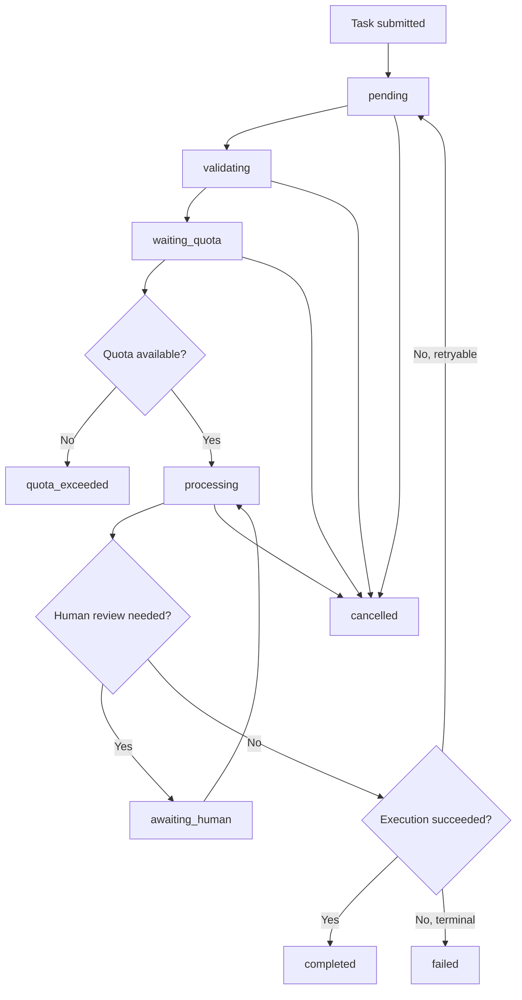
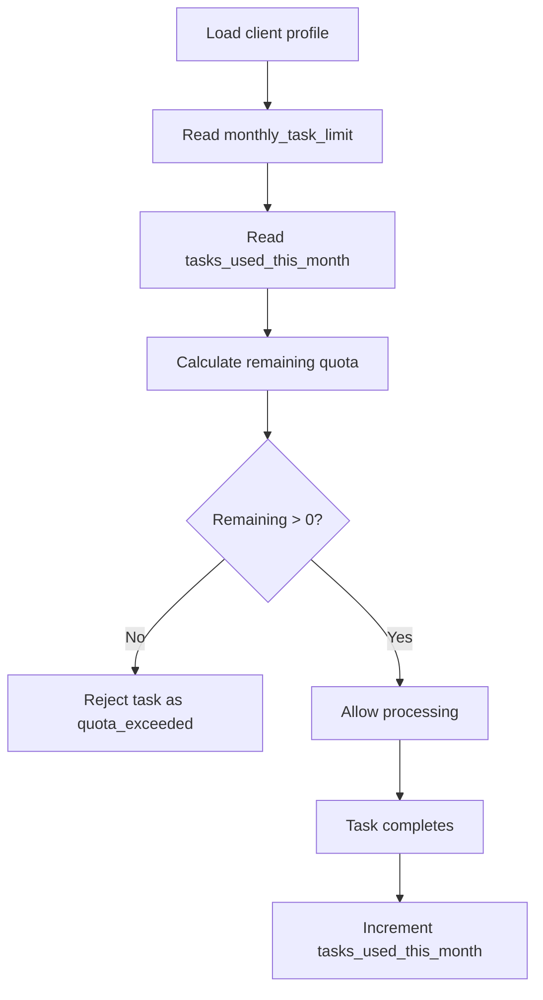

# Ikamva AI Operating System Architecture

## Purpose

This repository is now structured as the foundation for a vendor-independent AI Operating System. The frontend remains React + Vite, while backend concerns are separated into service interfaces, repositories, integrations, workers, middleware, and API entry points.

## Tenant Architecture

Ikamva is multi-tenant by default.

Each `tenant` represents an operating boundary for a business account. Users join tenants through `tenant_users`. Client-facing quota and billing-cycle state lives on `client_profiles`, not on auth users, so authentication can change providers without changing business rules.

Core tenant tables:

- `tenants`: account boundary.
- `tenant_users`: users and roles inside a tenant.
- `client_profiles`: client settings, quota limits, quota usage, and billing-cycle dates.
- `client_sops`: versioned SOP definitions for repeatable task execution.
- `task_queue`: durable task intake and execution state.
- `task_logs`: immutable task history.

## Service Boundaries

External dependencies must live behind service interfaces:

- `AuthService`
- `DatabaseService`
- `StorageService`
- `QueueService`
- `AIService`
- `EmailService`
- `CalendarService`
- `NotificationService`

React components must not import provider SDKs directly. A component talks to app services or context providers. Services coordinate business logic. Repositories own persistence. Provider adapters own SDK-specific code.

## Repository Pattern

```text
Component
  ↓
Service
  ↓
Repository
  ↓
Provider
```

Disallowed:

```text
React
  ↓
Provider SDK
```

This keeps Supabase, AI providers, email providers, and storage providers replaceable.

## Dependency Flow

Backend execution is composed through a small explicit service container.

```text
ServiceContainer
  ↓
RepositoryFactory.forTenant(tenantId)
  ↓
Tenant-scoped repositories
  ↓
Services
  ↓
WorkerEngine
```

`RepositoryFactory.forTenant(tenantId)` is the only normal way to create tenant-scoped repositories. The factory injects tenant context into repository methods so services do not need to remember tenant filters on every repository call.

`RepositoryFactory.forSystem()` is reserved for controlled backend operations that intentionally require cross-tenant access, such as maintenance, migrations, telemetry, and administrative worker tasks. It must not be used by ordinary request or worker flows.

The service container uses explicit registrations only. It does not use decorators, reflection, auto-wiring, or an external dependency injection framework.

## SOP Execution Flow

1. A task is submitted with a tenant, task type, payload, and idempotency key.
2. The system resolves the active SOP for the tenant and task type.
3. Payload validation runs against the SOP `validation_schema`.
4. The payload is normalized into `normalized_payload`.
5. Quota is checked against `client_profiles`.
6. The task is claimed by a worker.
7. The AI service executes using the SOP `system_prompt`, model settings, and output schema.
8. Output is validated.
9. The task transitions to `completed`, `awaiting_human`, `failed`, or another terminal/intermediate state.
10. Every status change writes an immutable `task_logs` entry.

## Task Lifecycle



## Quota Validation Flow



Monthly reset is intentionally prepared at the service boundary and should be implemented in workers once billing and scheduling rules are finalized.
