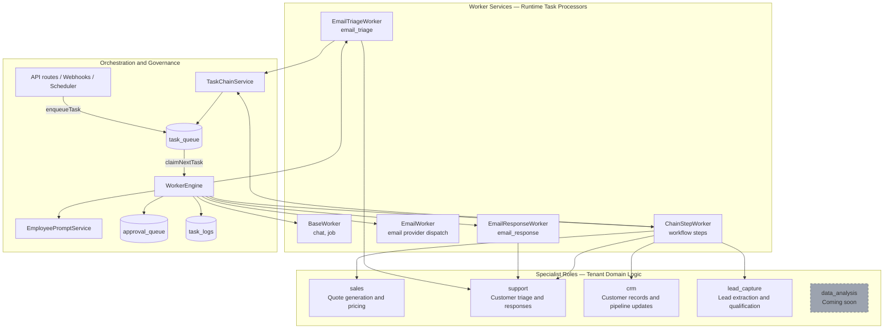
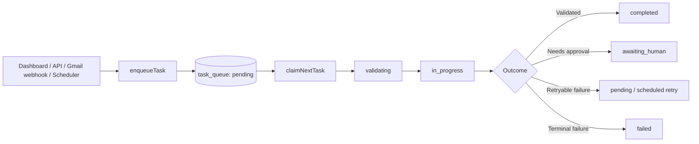
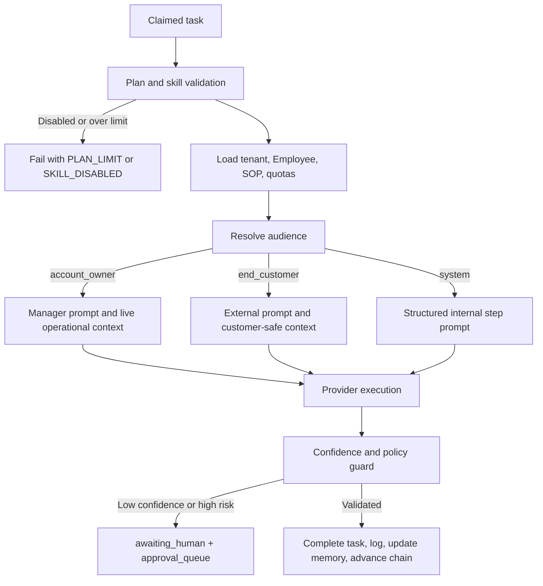
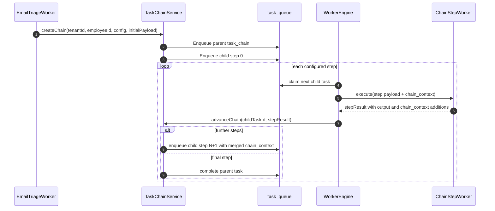

# Runtime Architecture

## Purpose

This document describes the Ikamva AI Operating System runtime: how work enters the queue, is authorized and grounded, is routed by audience and specialist role, executes through workers, and advances through multi-step task chains.

It distinguishes **Specialist Roles** (tenant-scoped business capabilities) from **Worker Services** (runtime executors). They are not the same thing: a worker may execute work for more than one specialist, while each specialist controls which business capability is enabled for a tenant.

---

## Architectural Layers



---

## Specialist Roles

Specialists are tenant-scoped capability profiles stored in `ai_employee_specialists`. They govern routing, enablement, configuration, attribution, and client-visible team status. They do not imply a dedicated process or a separate customer-facing identity.

| Specialist | Primary capability | Typical chain steps | Default state |
|---|---|---|---|
| `sales` | Quotes, pricing inquiries, sales requests | `crm_lookup`, `quote_generate`, `email_draft`, `approval_gate`, `email_send` | Enabled |
| `support` | Customer email triage and support responses | `email_read`, `crm_lookup`, `support_response`, `email_draft`, `approval_gate`, `email_send` | Enabled |
| `crm` | Customer/account updates and interaction tracking | `crm_lookup`, `crm_update` | Enabled only when a CRM integration is connected |
| `lead_capture` | Lead identification and qualification | `email_read`, `crm_lookup`, `lead_capture`, `crm_update` | Disabled until client opt-in |
| `data_analysis` | Future analytics capability | None until a supported chain exists | Disabled; `config.status = 'not_yet_available'` |

### Single External Identity

Specialists remain internal. Every end-customer email is sent under the tenant Employee's shared external name, role, and signature. A customer must not see labels such as “Support Specialist” or “Sales Specialist,” nor internal routing, model, approval, or scheduling details.

---

## Worker Services

Workers are registered by `createExecutionContainer.js`, resolved through the worker registry, and coordinated by `WorkerEngine`.

| Worker | Registered task types | Runtime responsibility | Specialist relationship |
|---|---|---|---|
| `BaseWorker` | `chat`, `job` | Handles dashboard-manager chat and generic jobs | `chat` operates as the Manager for the `account_owner` audience; it can inspect all specialist activity |
| `EmailTriageWorker` | `email_triage` | Reads/classifies inbound email, resolves the target specialist, handles disabled-capability path | Usually routes to `support`, `sales`, `crm`, or `lead_capture` according to classification |
| `EmailResponseWorker` | `email_response` | Synthesizes customer reply content and confidence data | Typically supports the `support` role; uses external Employee identity |
| `EmailWorker` | `email` | Dispatches email through Gmail MCP or HTTP email adapter | Delivers the already-authorized customer-facing message; does not choose specialist policy |
| `ChainStepWorker` | `email_read`, `crm_lookup`, `quote_generate`, `support_response`, `lead_capture`, `crm_update`, `email_draft`, `approval_gate`, `email_send` | Executes atomic, typed workflow steps | Executes steps for sales, support, CRM, and lead-capture specialists |

### Key Rule

A worker is an **execution mechanism**. A specialist is an **enabled business capability**. For example, one `ChainStepWorker` instance may execute both a `quote_generate` step for the Sales Specialist and a `crm_update` step for the CRM Specialist. The task or chain's `specialist_id` preserves attribution.

---

## Intake and Queue Lifecycle



1. An API route, dashboard action, Gmail webhook, or scheduler calls `enqueueTask()`.
2. The task is persisted in `task_queue` as `pending`.
3. `WorkerRuntime` polling calls `claimNextTask()` and acquires a lease before execution.
4. `WorkerEngine.processTask()` transitions the claimed task through validation and execution.
5. The task is completed, parked in `awaiting_human`, requeued for retry, or marked failed according to policy and outcome.

---

## Safe Concurrent Claiming

Under multiple worker instances, task claiming must be atomic. Use PostgreSQL row locking with `FOR UPDATE SKIP LOCKED`, not a simple non-atomic `UPDATE ... WHERE status = 'pending'` query.

```sql
WITH next_task AS (
    SELECT id
    FROM task_queue
    WHERE status = 'pending'
      AND (scheduled_at IS NULL OR scheduled_at <= NOW())
      AND (lease_expires_at IS NULL OR lease_expires_at < NOW())
    ORDER BY priority DESC, created_at ASC
    LIMIT 1
    FOR UPDATE SKIP LOCKED
)
UPDATE task_queue
SET
    status = 'in_progress',
    worker_id = $1,
    claimed_at = NOW(),
    lease_expires_at = NOW() + INTERVAL '60 seconds'
FROM next_task
WHERE task_queue.id = next_task.id
RETURNING task_queue.*;
```

Use a partial index to keep claims efficient as completed task history grows:

```sql
CREATE INDEX idx_task_queue_unclaimed
ON task_queue (priority DESC, created_at ASC)
WHERE status IN ('pending', 'in_progress');
```

### Lease Renewal and Recovery

Long-running tasks renew their lease before expiry, for example every 20 seconds for a 60-second lease. If a worker crashes, the lease expires and the atomic claim query makes the orphaned task eligible for another worker. `TaskChainService.recoverStalledChains()` provides chain-level recovery for stalled workflows.

---

## WorkerEngine Pipeline



### Plan, Skill, and Quota Gate

Before a model call consumes tokens or an external action is dispatched, the engine checks:

- Tenant plan entitlement, such as `starter`, `growth`, or `premium`
- Skill/capability enablement, such as `quotes_and_invoicing`, `email_management`, or `crm`
- Specialist enablement for the resolved capability
- Applicable quota and approval requirements

Rejected work fails with an explicit state such as `PLAN_LIMIT` or `SKILL_DISABLED`; it must not appear to have completed.

---

## Audience Resolution

Audience is determined by the application code path, never by model inference.

| Rule | Audience | Prompt mode | Schedule policy |
|---|---|---|---|
| `task_type === 'chat'` from dashboard | `account_owner` | Manager | Never schedule-gated |
| `parent_task_id !== null` | `system` | Deterministic chain-step prompt | Not applicable |
| Genuine public customer task | `end_customer` | Public single-identity prompt | Evaluated in application code |

### Account Owner / Manager Mode

The dashboard “test your Employee” surface is permanently the account-owner management interface, not a simulated customer conversation. The Manager may discuss internal status, enabled/disabled specialists, real activity, pending approvals, configuration, and reports. It never uses an out-of-office path or refers to shift hours.

### End-Customer Mode

A public customer receives only the tenant's shared Employee identity. The prompt excludes internal topology, specialist names, status, task logs, raw tool output, tenant-admin controls, and internal decision traces.

### System Mode

System prompts support backend chain execution and return structured, machine-consumable output. They are never rendered directly to an account owner or end customer.

---

## Prompt and Context Grounding

`EmployeePromptService` creates the stored Employee prompt base, and `WorkerEngine.assembleContextPrompt()` adds task-specific context.

### Account Owner Context

For the Manager, context is real-time and tenant-scoped:

- `LIVE SPECIALIST TEAM STATUS` from `SpecialistRepository.listByEmployee()`
- `RECENT SPECIALIST ACTIVITY` from recent tasks and task logs
- `LIVE PENDING APPROVALS` from `approval_queue`
- Gmail read tools for account-owner questions about the connected inbox

The Manager must use actual queries/tools and must not fabricate counts, activity, or approval status.

### End-Customer Context

For customer-facing work, context is sanitized and task-relevant:

- Company knowledge retrieved through vector/keyword RAG using `CompanyKnowledgeRepository`
- Thread and durable customer context from `EmployeeMemoryRepository`
- Relevant Gmail thread/message data
- Customer/CRM context when it is authorized and relevant
- An approved OOO template only when application code has selected that path

### Shift-Hours Rule

Shift-hours evaluation occurs only in application code. The prompt must never ask the model to evaluate server time, compare hours, or decide whether a schedule applies.

```javascript
const isWithinShiftHours = isWithinTenantShiftHours({
  now: clock.now(),
  timezone: tenant.schedule.timezone,
  workingDays: tenant.schedule.workingDays,
  start: tenant.schedule.shiftHours.start,
  end: tenant.schedule.shiftHours.end,
});
```

For `account_owner`, no schedule value or OOO instruction is required. For an eligible `end_customer` inbound contact outside business hours, application code chooses the OOO response path; the model receives only the selected customer-facing response constraint/template, never raw scheduling reasoning.

---

## Specialist Routing and Disabled Capability Path

`EmailTriageWorker` extends its existing `decision.category` classification into a deterministic capability route:

```text
email category -> specialist_type -> specialist configuration -> prompt/chain
```

Example mapping:

| Classified category | Target specialist |
|---|---|
| Quote request or pricing inquiry | `sales` |
| General question, complaint, support request | `support` |
| Customer data update | `crm` |
| Prospect / lead inquiry | `lead_capture` |

### Enabled Specialist

When the resolved specialist is enabled, routing creates or advances the appropriate chain with its `specialist_id`. The specialist configuration is included only in that specialist's internal prompt construction; the external signature remains the shared Employee identity.

### Disabled Specialist

When the mapped specialist is disabled:

1. Do not drop the customer message.
2. Do not reroute it to a different specialist merely to create an answer.
3. Send an approved, minimal holding reply as the base Employee identity.
4. Write a `disabled_specialist_attempt` audit event with tenant, email, specialist type, and timestamp.
5. Surface the capability gap to the Manager through team activity/status.

This gives the account owner a truthful signal, such as “3 requests came in for a capability you have not enabled,” instead of hiding unmet demand.

---

## Multi-Step Chains and Handoffs

`TaskChainService` orchestrates multi-step workflows deterministically through parent-child task lineage in `task_queue`.



### Task Lineage

| Entity | Purpose |
|---|---|
| Parent task | `task_type: 'task_chain'`; stores `chain_config.steps`, status, shared `chain_context`, and specialist attribution |
| Child task | One atomic step; stores `parent_task_id`, `step_index`, `step_name`, and deterministic idempotency key |
| Idempotency key | `${parent.id}:${step_index}`; prevents duplicate step execution |

### Context Accumulation

Each step receives accumulated `chain_context`. On completion, new context is merged before creating the next child:

```javascript
const nextContext = {
  ...priorContext,
  ...(stepResult.output.chain_context || {})
};
```

This is the runtime IPC mechanism: workers exchange only persisted, audited task payload/context rather than retaining process memory across steps.

---

## Approval, Pause, and Resume

When confidence is below 50%, autonomy policy requires review, or a step needs client input:

1. The worker writes a structured approval request to `approval_queue`.
2. The parent task moves to `awaiting_human` (or `suspended`, if that is the established status name).
3. Its lease is released; no worker process or database lock remains held while waiting.
4. The account owner approves, rejects, or supplies requested input through the dashboard.
5. The approval API calls `TaskChainService.resumeChain(taskId, userInputs)`.
6. The service persists the input into `chain_context` and enqueues the appropriate next step.

This produces state-preserving pause/resume behavior without sleeping processes or long-held transactions.

---

## Completion, Failure, and Auditability

### Successful Completion

Validated work completes the task, updates relevant memory where permitted, records an immutable task log, updates specialist activity, and advances the chain when another step remains.

### Failure Isolation

If a child step fails:

1. `TaskChainService.failChain(childTaskId, error)` marks the parent task `FAILED`.
2. A `CHAIN_FAILED` audit event records the failing step index/name and error metadata.
3. Later child steps are not enqueued.
4. Stalled-chain recovery can identify and recover eligible interrupted work; it must not blindly duplicate completed idempotent steps.

### Alert Dispatch

Failure alerts must occur after the state transition commits and must not block or destabilize task execution.

```javascript
async failChain(childTaskId, errorContext) {
  const client = await this.db.transaction();
  try {
    const parentTask = await this.markParentFailed(client, childTaskId, errorContext);
    await client.commit();

    setImmediate(() => {
      this.alertDispatcher.dispatchChainFailure({
        parentTask,
        childTaskId,
        error: errorContext
      }).catch(err => console.error('Alert dispatch failed:', err));
    });
  } catch (err) {
    await client.rollback();
    throw err;
  }
}
```

### Alert Payload

A chain-failure alert should include:

```json
{
  "event": "TASK_CHAIN_FAILED",
  "timestamp": "2026-09-11T20:42:19Z",
  "environment": "production",
  "tenant_id": "tenant_abc123",
  "chain_id": "task_chain_9982a",
  "failing_step": {
    "step_index": 3,
    "step_name": "quote_generate",
    "worker_type": "ChainStepWorker"
  },
  "error": {
    "code": "LLM_SCHEMA_VALIDATION_ERROR",
    "message": "Model response missing required field: unit_price"
  },
  "context_snapshot": {
    "customer_id": "cust_4451",
    "parent_task_id": "task_chain_9982a",
    "execution_duration_ms": 1420
  }
}
```

Deduplicate alerts by a key such as `tenant_id:error_code`. When the same fault exceeds a defined threshold (for example, five times in 60 seconds), send a grouped summary instead of an alert for every failure.

---

## Tool and Model Governance

### Grounded Tools

Tools must be tenant-scoped, schema-validated, and authorized before execution. The Manager can inspect live team status, specialist activity, approvals, and its connected Gmail data. Customer-facing specialists receive only the tools necessary for their task and must not reveal tool use or raw results.

### Tool Manifests

Specialists should register self-describing manifests containing:

- Capability name and specialist type
- Strict JSON input/output schemas
- Permission scope
- Whether the tool is read-only or mutating
- Approval requirement for sensitive actions

The Manager can query manifests to describe available capability without hardcoding every new tool in its core prompt.

### Dynamic Model Tiering

Worker or chain-step configuration may choose a `model_tier` per step:

| Tier | Appropriate tasks |
|---|---|
| `lightweight` | Classification, extraction, formatting, simple validation |
| `standard` | Normal response drafting and grounded synthesis |
| `reasoning` | Complex planning, high-value analysis, multi-constraint decisions |

The chosen provider/model must support the tools and structured-output features required by that step. Tool support is a functional requirement, not an optional enhancement.

---

## Runtime Invariants

1. Every prompt has an explicit, code-set `audience`; missing audience is an error.
2. Dashboard `chat` is always `account_owner`, handled as Manager interaction, and is never schedule-gated.
3. Real customer-facing tasks use `end_customer`; internal handoffs use `system`.
4. The model never evaluates shift hours or receives an instruction to reason about server time.
5. Customer communication always uses the single external Employee identity.
6. Specialist enablement controls routing; disabled capability requests receive an honest holding reply and audit event.
7. All task, tool, specialist, approval, and memory queries are tenant-scoped.
8. Worker concurrency uses atomic lease claiming and supports recovery after a crash.
9. Task-chain steps are idempotent and pass state through persisted `chain_context`.
10. Manager reports and activity summaries are grounded in actual database/tool results, never fabricated.

---

## Source Map

| Responsibility | Primary module |
|---|---|
| Dependency registration | `backend/container/createExecutionContainer.js` |
| Task execution and audience/context assembly | `backend/workers/WorkerEngine.js` |
| Base chat/job execution | `backend/workers/BaseWorker.js` |
| Inbound email classification and specialist routing | `backend/workers/EmailTriageWorker.js` |
| Email response synthesis | `backend/workers/EmailResponseWorker.js` |
| Provider email dispatch | `backend/workers/EmailWorker.js` |
| Atomic chain-step execution | `backend/workers/ChainStepWorker.js` |
| Parent-child chain orchestration | `backend/services/TaskChainService.js` |
| Stored Employee prompt base | `backend/services/EmployeePromptService.js` |
| Specialist persistence and enablement | `SpecialistRepository` / `ai_employee_specialists` |
| Queue persistence and leases | `task_queue` / queue service |
| Approval state | `approval_queue` |
| Immutable runtime audit trail | `task_logs` |

---

## Maintenance Rule

Update this document in the same change set as any modification to worker registration, task types, audience routing, chain steps, specialist routing, task queue lease behavior, prompt context assembly, approval lifecycle, or alert dispatch.
